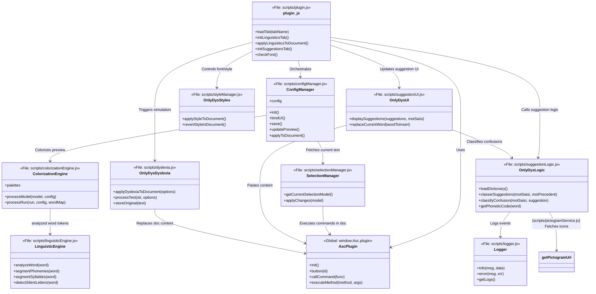

# OnlyDys Plugin for ONLYOFFICE

## Overview

OnlyDys is a privacy-first ONLYOFFICE plugin designed to assist users with dyslexia, particularly those writing in French. It provides a suite of tools to make reading and writing more accessible, including real-time word suggestions, dyslexia-friendly document styling, and grammatical color-coding.

The plugin is compatible with both self-hosted and desktop versions of ONLYOFFICE editors and can be added manually to any instance.

## Features

- **Two Suggestion Modes**:
    - **Selection Mode (Manual)**: Select text and click "Paste Selection" to get suggestions, or simply type in the box.
    - **On-the-go Mode (Automatic)**: The plugin automatically detects the word under your cursor or selection and updates suggestions in real-time as you navigate.

- **Suggestion Classification**: Each suggestion is categorized and color-coded to help the user understand the nature of the potential error:
    - ⚠️🔴 **Visual Confusion**: Highlights possible mix-ups between visually similar letters (e.g., b/d, p/q).
    - 🔊🟧 **Phonetic Confusion**: Indicates words that are spelled differently but sound similar.
    - 🔀🟪 **Homophones**: Flags words that sound the same but have different meanings and spellings.
    - 📝🟦 **Morphological Errors**: Catches common mistakes in word endings, like pluralization or conjugation.

- **Interactive Suggestion Cards**: Each suggestion is displayed on an interactive card:
    - **Click to Replace**: Simply click the card to replace the word in the document with the suggestion.
    - **Text-to-Speech**: Click the speaker icon (🗣️) to hear the suggested word read aloud.
    - **Illustrations**: Displays an image for the word when available, providing a visual aid for comprehension.

- **Advanced Linguistic Formatting & Styling**: A dedicated "Linguistics" tab provides deep linguistic analysis and styling for French text:
    - **Global Formatting**: With a single click, apply **OpenDyslexic Font** and enhanced spacing to the entire document (without changing colors).
    - **Grammatical Coloring**: Select "Grammatical Categories" mode to color-code words (Noun, Verb, etc.) based on their function.
    - **Phoneme Colorization**: Highlights distinct phonemes (sounds) with different colors.
    - **Syllable Segmentation**:
        - **Alternating Colors**: colors syllables in alternating shades.
        - **Syllable Arcs**: Draws vector arcs underneath syllables.
    - **Silent Letter Detection**: Automatically detects and greys out silent letters.

- **Smart Font Detection**: The plugin automatically checks if the **OpenDyslexic** font is installed on your system. If missing, a "Font" tab will appear with installation instructions.

## How to Use

1.  **Open the Plugin**: Click the "Plugins" tab in the ONLYOFFICE editor and select the "OnlyDys" plugin.
2.  **Get Suggestions**:
    - **Default**: Use the toggle to switch between "Selection" (Manual) or "On-the-go" (Auto) modes.
    - **On-the-go**: Simply move your cursor or select text; suggestions appear automatically.
    - **Manual**: Select text, click "Paste Selection", then "Check".
    - To replace a word, click the desired suggestion card.
3.  **Linguistics & Styling**:
    - Switch to the **"Linguistics"** tab.
    - **Apply Font & Spacing**: Click the button at the bottom to apply OpenDyslexic font and spacing globally (no colors).
    - **Apply Analysis/Coloring**:
        - Select a **Mode** (Grammatical Categories, Phonemes, Syllables, etc.).
        - Click **Apply to Selection** to color-code the selected text.
4.  **Dyslexia Simulation**:
    - Switch to the **"Dyslexia"** tab to simulate how a dyslexic person might perceive the text.

## Installation

To install the OnlyDys plugin: 

 - In `OnlyOffice Desktop Editors`, open the **Plugins** tab.

 - Click **Settings** -> **Add Plugin**.

 - Select the [OnlyDys.plugin](https://github.com/Edouard-Legoupil/OnlyDys/raw/refs/heads/main/deploy/OnlyDys.plugin) file.
    
The OnlyDys plugin will be then available in the "Plugins" tab.

## Development

### Background 

The primary user and tester for this plugin is my daughter, Lisa, and the school she is attending in Normandy. Though, this tool might support  as well other kids with similar challenges. 

I have reviewed a set of existing tools (unfortunately none being both open source and working on a Linux desktop...) and combined them to build this plugin:

 - [PhonoWriter](https://www.jeanclaudegabus.ch/produits/phonowriter/)
 - [Colorization](https://colorization.ch/)
 - [LireCouleur](https://forge.apps.education.fr/lirecouleur/lirecouleur.forge.apps.education.fr)
 - [Studys](https://studys.fusofrance.org/)
 - [Cartable Fantastique](https://www.cartablefantastique.fr/outils-pour-compenser/le-plug-in-libre-office/)
 - [Lexibar](https://www.lexibar.ca/ca/en/)

The plugins integrates fonts with specific focus on dyslexia and dysgraphia:

- [OpenDyslexic](https://opendyslexic.org/)
- [Accessible-DfA](https://github.com/Orange-OpenSource/font-accessible-dfa)
- [Luciole](https://www.luciole-vision.com/#download)

### Environment

This tool was mostly coded using vibe coding in [Antigravity](https://antigravity.google/) and [jules](https://jules.google.com). You can clone the repository to contribute. **To build the plugin**:
 - Run the build script: `python3 package_plugin.py`
 - This will create the `OnlyDys.plugin` file in the `deploy` folder.

If you spot any issue or have any ideas of additional features or capabilities, please [create an issue here](https://github.com/Edouard-Legoupil/OnlyDys/issues/new).

### Viewing Logs

The plugin uses a custom logger to output debugging information to the browser's console. To view the logs, you'll need to open the developer tools in your browser.

1.  **Open the developer tools.** In most browsers, you can do this by pressing `F12` or by right-clicking on the page and selecting "Inspect".
2.  **Navigate to the console.** The console is where the plugin will output its logs.
3.  **Set the log level.** By default, the logger is set to the `INFO` level. You can change the log level by opening the console and typing `logger.setLevel(logger.LogLevel.DEBUG)`. This will enable all logging levels.

### Running Unit Tests

The plugin includes a suite of unit tests to ensure that the core logic is working correctly. To run the tests, you'll need to open the `tests/test.html` file in your browser.

1.  **Navigate to the `tests/` directory.**
2.  **Open the `test.html` file in your browser.** This will run the tests and display the results in the browser.

### Architecture & Class Interactions

The OnlyDys plugin follows a modular architecture where different components handle specific linguistic and UI tasks.

#### Component Diagram

| Component | File Reference | Responsibility |
| :--- | :--- | :--- |
| **plugin.js** | [scripts/plugin.js](scripts/plugin.js) | The core orchestrator. Handles tab switching, initialization, and high-level command execution. |
| **ConfigManager** | [scripts/configManager.js](scripts/configManager.js) | Manages user settings (mode, arcs, silent letters). Handles UI bindings for the settings tab and persistence. |
| **SelectionManager** | [scripts/selectionManager.js](scripts/selectionManager.js) | Abstracts ONLYOFFICE document access. Converts selections into a structured JSON model and back. |
| **LinguisticEngine** | [scripts/linguisticEngine.js](scripts/linguisticEngine.js) | The "brain" for French processing. Handles vowel/consonant detection, syllable splitting, and silent letter rules. |
| **ColorizationEngine** | [scripts/colorizationEngine.js](scripts/colorizationEngine.js) | Bridge between linguistic analysis and visual formatting. Applies colors to the text model based on config. |
| **OnlyDysStyles** | [scripts/styleManager.js](scripts/styleManager.js) | Specifically handles global document-wide formatting like the OpenDyslexic font, line height, and spacing. |
| **OnlyDysDyslexia** | [scripts/dyslexia.js](scripts/dyslexia.js) | Implements the dyslexia simulation (scrambling letters) to help users empathize with dyslexic readers. |
| **OnlyDysLogic** | [scripts/suggestionLogic.js](scripts/suggestionLogic.js) | Contains the algorithmic core for suggestions: phonetic coding, Levenshtein distance, and confusion classification. |
| **OnlyDysUI** | [scripts/suggestionUI.js](scripts/suggestionUI.js) | Manages the dynamic creation of HTML elements for suggestions, including visual icons and read-aloud buttons. |
| **Logger** | [scripts/logger.js](scripts/logger.js) | Provides centralized logging for debugging, with the ability to download logs via the "About" tab. |
| **Pictogram Service** | [scripts/pictogramService.js](scripts/pictogramService.js) | Helper to fetch ARASAAC pictograms for words to provide visual aids. |
