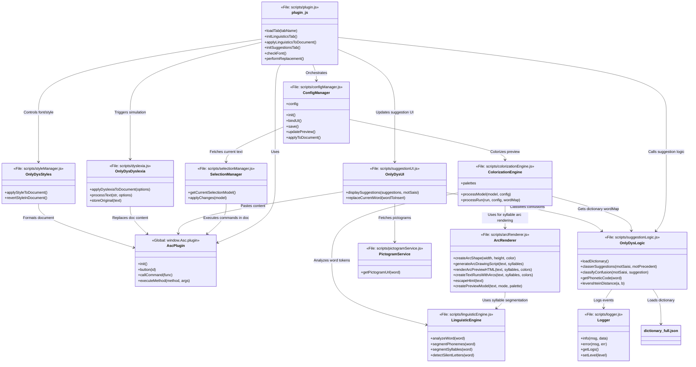

# OnlyDys Plugin Specification

## Document Information

| Field | Value |
|-------|-------|
| **Specification ID** | 001-onlydys |
| **Version** | 1.2.0 |
| **Last Updated** | 2025-01-XX |
| **Author** | Based on analysis by Mistral Vibe |
| **Status** | Active |

---

## 1. Executive Summary

OnlyDys is a **privacy-first**, **open-source** ONLYOFFICE plugin designed to assist users with dyslexia, particularly for French language text. The plugin integrates seamlessly with both self-hosted and desktop versions of ONLYOFFICE editors, providing real-time assistive features for reading and writing.

### 1.1 Core Value Proposition

- **Accessibility**: Makes reading and writing accessible for dyslexic users
- **Privacy**: 100% client-side processing - no data sent to external servers (except optional pictogram API)
- **Offline-capable**: Works without internet connection (except for pictogram fetching)
- **Cross-platform**: Compatible with Word, Cell, and Slide editors in ONLYOFFICE
- **No installation required**: Can be manually added to any ONLYOFFICE instance

### 1.2 Target Audience

| User Type | Description |
|-----------|-------------|
| Primary | French-speaking individuals with dyslexia (children and adults) |
| Secondary | Educators and schools supporting dyslexic students |
| Tertiary | Parents of dyslexic children |
| Technical | Developers contributing to open-source accessibility tools |

---

## 2. Product Overview

### 2.1 High-Level Description

OnlyDys provides a comprehensive suite of tools embedded within the ONLYOFFICE editor interface. Users can access the plugin through a dedicated tab, where they can:

1. Get real-time word suggestions with classification
2. Apply dyslexia-friendly document styling
3. Color-code text based on linguistic analysis
4. Simulate dyslexic perception of text
5. View pictograms for visual word comprehension

### 2.2 Plugin Identity

```json
{
  "name": "OnlyDys",
  "guid": "asc.{16781C62-157C-466A-82E7-27005D51E6D0}",
  "version": "1.0.0",
  "minVersion": "6.3.0",
  "isVisual": true,
  "isModal": true,
  "isInsideMode": true,
  "editorsSupport": ["word", "cell", "slide"]
}
```

---

## 3. Functional Requirements

### 3.1 Feature Matrix

| Feature | Description | Status | Priority |
|---------|-------------|--------|----------|
| Real-time Suggestions | Automatic word suggestions as user types | ✅ Implemented | P0 |
| Manual Suggestions | Check selected text on demand | ✅ Implemented | P0 |
| Classification Engine | Categorizes suggestions by error type | ✅ Implemented | P0 |
| Grammatical Coloring | Color-code words by grammatical category | ✅ Implemented | P0 |
| Phoneme Coloring | Highlight distinct phonemes | ✅ Implemented | P0 |
| Syllable Segmentation | Visual syllable separation | ✅ Implemented | P0 |
| Syllable Arcs | Draw arcs under syllables | ⚠️ Partial | P1 |
| Silent Letter Detection | Grey out silent letters | ✅ Implemented | P0 |
| Dyslexia Simulation | Scramble letters to simulate dyslexic perception | ✅ Implemented | P0 |
| OpenDyslexic Font | Apply dyslexia-friendly font globally | ✅ Implemented | P0 |
| Enhanced Spacing | Increase letter and line spacing | ✅ Implemented | P0 |
| Text-to-Speech | Read words aloud | ✅ Implemented | P0 |
| Pictogram Support | Display ARASAAC pictograms | ✅ Implemented | P1 |
| Pictogram Display in Suggestions | Show pictogram buttons directly in suggestion cards | ✅ Implemented | P1 |
| Smart Font Detection | Check if OpenDyslexic is installed | ✅ Implemented | P1 |
| Debouncing for On-the-go Suggestions | Rate-limiting to prevent rapid API calls during cursor movement | ✅ Implemented | P1 |
| Loading Overlay | Visual feedback during dictionary initialization | ✅ Implemented | P1 |
| Restricted Mode Detection | Fallback mechanism for limited ONLYOFFICE editor APIs | ✅ Implemented | P1 |
| Color-Blind Palette Selection | 5 color-blind friendly palettes with dynamic legend | ✅ Implemented | P1 |

### 3.2 Suggestions System

#### 3.2.1 Modes

**Selection Mode (Manual)**
- User selects text and clicks "Paste Selection" or types in input box
- Click "Check" to get suggestions
- Supports up to 9 words at once (to prevent performance issues)

**On-the-go Mode (Automatic)**
- Plugin automatically detects word under cursor or current selection
- Suggestions update in real-time as user navigates
- Falls back to selection-based detection if API limitations exist

#### 3.2.2 Suggestion Classification

The plugin classifies suggestions into four primary categories:

| Category | Type | Color | Icon | Description |
|----------|------|-------|------|-------------|
| Visual Confusion | ⚠️ Visual | #D55E00 (Vermilion) | ⚠️ | Mix-ups between visually similar letters (b/d, p/q, n/u) |
| Phonetic Confusion | 🔊 Phonetic | #E69F00 (Orange) | 🔊 | Words that sound similar but are spelled differently |
| Homophone | 🔀 Homophone | #CC79A7 (Purple) | 🔀 | Words that sound identical but have different meanings |
| Morphological | 📝 Morphological | #0072B2 (Blue) | 📝 | Common mistakes in word endings, pluralization, conjugation |

**Classification Algorithm:**
```
1. Calculate phonetic distance using Soundex-like code
2. Calculate orthographic distance using Levenshtein algorithm
3. Calculate semantic score based on word frequency and grammatical context
4. Combine scores: 40% phonetic + 30% orthographic + 30% semantic
5. Classify based on error pattern detection
```

#### 3.2.3 Suggestion Display

Each suggestion appears as an interactive card containing:
- **Color-coded border** indicating confusion type
- **Confusion icon** (⚠️, 🔊, 🔀, 📝)
- **Suggested word** (bold)
- **Replace button** (🔄) - inserts word in document
- **Text-to-speech button** (🔊) - reads word aloud
- **Pictogram button** (🖼️) - opens modal dialog showing ARASAAC pictogram for the suggested word
- **Illustration** (if available from dictionary)

**Pictogram Display Integration:**
- Each suggestion card includes a dedicated pictogram button (🖼️)
- Clicking the button triggers `getPictogramUrl()` from `pictogramService.js`
- Displays modal with 500x500px transparent PNG from ARASAAC
- Falls back to "Aucun pictogramme trouvé" message if not available
- Pictograms provide visual reinforcement for word comprehension

#### 3.2.4 Color-Blind Palette Selection

**Purpose:** Provide color-blind friendly color schemes for users with color vision deficiency (CVD), including Protanopia, Deuteranopia, and Tritanopia.

**Features:**
- 5 scientifically-designed color palettes optimized for accessibility
- Dynamic color legend that updates to show current palette
- Persistent selection saved to localStorage
- Real-time preview in Linguistics tab

**Available Palettes:**

| Name | Description | Source | Best For |
|------|-------------|--------|----------|
| **Default** | Original OnlyDys color scheme | Custom | General use |
| **Okabe-Ito** | Color Universal Design - scientifically optimized for all CVD types | [Okabe & Ito, 2008](https://jfly.uni-koeln.de/color/) | All color blindness |
| **Tol's Qualitative** | Paul Tol's qualitative color scheme | [Paul Tol](https://personal.sron.nl/~pault/) | Color distinction |
| **Viridis** | Perceptually uniform color map | [viridis](https://cran.r-project.org/web/packages/viridis/) | Sequential data, CVD safe |
| **High Contrast** | Maximum contrast colors | Custom | Low vision, maximum readability |

**Palette Colors (Grammar Categories):**

**Default:**
- NOM: #D62728 (Bright Red), VER: #2B83BA (Vibrant Blue), ADJ: #2CA02C (Bright Green)
- ADV: #98DF8A (Light Green), PRO: #FF7F0E (Orange), DET: #BCBD22 (Olive/Chartreuse)
- PRE: #4B0082 (Indigo), CON: #8B4513 (Saddlebrown), INT: #E377C2 (Pink)

**Okabe-Ito:**
- NOM: #E69F00 (Orange), VER: #56B4E9 (Blue), ADJ: #009E73 (Green)
- ADV: #F0E442 (Yellow), PRO: #F0E442 (Yellow), DET: #0072B2 (Dark Blue)
- PRE: #000000 (Black), CON: #D55E00 (Vermilion), INT: #CC79A7 (Pink)

**Tol's Qualitative:**
- NOM: #332288 (Indigo), VER: #117733 (Green), ADJ: #44AA99 (Teal)
- ADV: #88CCEE (Cyan), PRO: #DDCC77 (Gold), DET: #CC6677 (Pink)
- PRE: #000000 (Black), CON: #AA4499 (Purple), INT: #CC6677 (Pink)

**Viridis:**
- NOM: #440154 (Dark Purple), VER: #482878 (Purple), ADJ: #3E4989 (Blue)
- ADV: #31688E (Blue), PRO: #26828E (Teal), DET: #1F9E89 (Green)
- PRE: #000000 (Black), CON: #35B779 (Green), INT: #1F9E89 (Green)

**High Contrast:**
- NOM: #0000FF (Blue), VER: #FF0000 (Red), ADJ: #00FF00 (Green)
- ADV: #FF8000 (Orange), PRO: #8000FF (Purple), DET: #FFFF00 (Yellow)
- PRE: #000000 (Black), CON: #FF00FF (Magenta), INT: #FF00FF (Magenta)

**User Interface:**
- Dropdown selector in Linguistics tab Global Options section
- Label: "Palette de couleurs (daltonisme)"
- Description: "Sélectionnez une palette adaptée pour le daltonisme"
- 5 options matching the palette names above

**Configuration:**
- Stored in: `ConfigManager.config.colorPalette`
- Default: `'default'`
- Type: string
- Persistence: localStorage (`onlydys_ling_config`)

**Implementation Details:**

**Palette System Architecture:**
```javascript
const PALETTES = {
    default: { name: 'Default', description: '...', grammar: {...}, highlight: {...} },
    okabeIto: { name: 'Okabe-Ito', description: '...', grammar: {...}, highlight: {...} },
    tolsQualitative: { ... },
    viridis: { ... },
    highContrast: { ... }
};

// Current palette management
let currentPaletteName = 'default';
function setCurrentPalette(name) { ... }
function getCurrentPalette() { return PALETTES[currentPaletteName]; }
```

**Color Legend:**
- Automatically updates when palette changes
- Shows palette name as title
- Displays color swatches with grammatical category labels
- Styled with flexbox for responsive layout
- Color boxes: 24x24px with border radius

**Highlighting Mode:**
- Each palette includes both text colors and background highlight colors
- Highlight colors are lighter versions of the same palette
- Automatically selected based on `useHighlighting` option

**Accessibility Features:**
- All palettes tested for color-blind safety
- Sufficient contrast between all colors
- Perceptually uniform where applicable (Viridis)
- High Contrast palette for low vision users
- Color and text both convey information (redundant coding)

#### 3.2.4 Debouncing for On-the-go Mode

**Purpose:** Prevent rapid-fire API calls and performance issues during cursor movement in on-the-go mode.

**Implementation:**
- Default delay: 150ms (configurable via UI input)
- Uses debounce pattern to batch rapid selection changes
- Storage: `ConfigManager.config.suggestionDebounceMs` in localStorage
- Min value: 0 (disabled), Max value: 1000ms

**User Control:**
- Configurable via input field in Linguistics tab options
- Label: "Délai de rebond (ms) - Suggestions:"
- Real-time preview: Delay updates as user types
- Persistence: Saved to localStorage automatically

**Technical Details:**
```javascript
// Debounce function in plugin.js
function debounce(func, delay) {
  let timeout;
  return function (...args) {
    clearTimeout(timeout);
    timeout = setTimeout(() => {
      debounceTimeout = null;
      func.apply(this, args);
    }, delay);
    debounceTimeout = timeout;
  };
}

// Applied to onSelectionChanged handler
debouncedOnSelectionChanged = debounce(
  suggestionService.handleSelectionChange,
  globalDebounceDelay
);
```

### 3.3 Linguistic Analysis System

#### 3.3.1 French Language Support

The plugin provides comprehensive French linguistic analysis:

**Vowels (26 characters):**
```
a, à, â, ä, e, é, è, ê, ë, i, î, ï, o, ô, ö, u, ù, û, ü, y, ÿ, œ, æ
```

**Multi-phoneme Sequences (30+ combinations):**
- Nasal vowels: eau, eaux, aient, oient
- Complex vowels: ain, aim, ein, eim, ien, ian, oin, on, om, an, am, en, em, in, im, yn, ym
- Vowel combinations: ou, oi, ai, ei, au, eu, œu
- Consonant digraphs: ch, ph, th, gn, qu, gu
- Special cases: ill, ail, eil, ouil, euil

**Silent Endings:**
```
ent, es, e, s, t, d, p, x, g, z
```

#### 3.3.2 Analysis Capabilities

| Analysis Type | Description | Algorithm |
|--------------|-------------|-----------|
| Phoneme Segmentation | Split words into phonetic units | Greedy matching with longest-first strategy |
| Syllable Segmentation | Split words into syllables | Vowel-nucleus based CV patterns |
| Silent Letter Detection | Identify non-pronounced letters | Ending-based pattern matching |
| Grammatical Classification | Identify word types | Dictionary lookup (Brulex-based) |

**Syllable Segmentation Rules:**
1. Identify vowel nuclei
2. Group preceding consonants with following vowel
3. Handle special French patterns (nasal vowels, digraphs)
4. Maximum onset principle for consonant clusters

### 3.4 Colorization Engine

#### 3.4.1 Color Palettes

**Standard Coloring (text color):**
```javascript
{
  phonemes: ["#D62728", "#2B83BA", "#2CA02C", "#FF7F0E", "#98DF8A", "#BCBD22", "#E377C2", "#4B0082"],
  syllables: ["#D62728", "#2B83BA"],
  words: ["#4B0082", "#2B83BA"],
  letters: ["#D62728", "#2B83BA", "#2CA02C", "#FF7F0E"],
  vowels: "#E377C2",
  consonants: "#2B83BA",
  silent: "#606060",
  punctuation: "#E377C2"
}
```

**Grammatical Category Colors:**
```javascript
{
  "NOM": "#D62728",    // Noun (Bright Red)
  "VER": "#2B83BA",    // Verb (Vibrant Blue)
  "ADJ": "#2CA02C",    // Adjective (Bright Green)
  "ADV": "#98DF8A",    // Adverb (Light Green)
  "PRO": "#FF7F0E",    // Pronoun (Orange)
  "DET": "#BCBD22",    // Determiner (Olive/Chartreuse)
  "PRE": "#4B0082",    // Preposition (Indigo)
  "CON": "#8B4513",    // Conjunction (Saddlebrown)
  "INT": "#E377C2"     // Interjection (Pink)
}
```

**Color Design Rationale:**
- All colors are color-blind friendly (tested against Protanopia, Deuteranopia, Tritanopia)
- PRE changed from black (#000000) to indigo (#4B0082) for visibility on all backgrounds
- DET and INT are now clearly distinguishable (olive vs pink, not both purple)
- ADJ and VER are now clearly distinguishable (green vs blue, not both blue-ish)
- Palette uses proven color schemes from ColorBrewer, IBM Design, and Okabe-Ito research

**Highlighting Mode (background color):**
- Uses lighter versions of the same color scheme
- Text color set to #000000 (black) for readability
- Available for all modes

#### 3.4.2 Colorization Modes

| Mode | Description | Use Case |
|------|-------------|----------|
| `none` | No colorization | Base state |
| `grammar` | Color by grammatical category | Grammar learning |
| `linguistic` | Phoneme-based coloring | Phonetic awareness |
| `alternance` | Alternating colors for syllables/phonemes | Visual rhythm |
| `highlight` | Background highlighting instead of text color | Improved readability |

**Sub-modes for Linguistic Analysis:**
- `phonemes` - Color each phoneme type
- `syllables` - Alternate syllable colors
- `silent` - Highlight silent letters
- `vowels` - Highlight vowels only
- `consonants` - Highlight consonants only
- `letters` - Highlight specific letter groups (e.g., bdpq)

### 3.5 Dyslexia Simulation

#### 3.5.1 Scrambling Algorithm

**Purpose:** Simulate how a dyslexic person might perceive text

**Algorithm:**
1. Preserve first and last letters of each word (maintains readability)
2. Apply Fisher-Yates shuffle to middle characters
3. For words < 5 characters: no scrambling (too short)
4. Random chance parameter (default: 100%)

**Example:**
```
Input:  "impossible"
Output: "imopssbile"

Input:  "the"
Output: "the" (unchanged, < 5 chars)
```

#### 3.5.2 Configuration Options

```javascript
{
  minWordLength: 5,      // Minimum word length to scramble
  scrambleChance: 100    // Percentage chance to scramble (0-100)
}
```

### 3.6 Style Management

#### 3.6.1 Global Document Formatting

Applies OpenDyslexic font and spacing to entire document:
- **Font Family**: OpenDyslexic (regular, bold, italic supported)
- **Font Size**: 24 half-points (12pt)
- **Line Height**: 480 twips (2.0em)
- **Letter Spacing**: 36 twips
- **Alignment**: Left-justified

#### 3.6.2 Formatting Reversion

Uses ONLYOFFICE's native Undo functionality to restore previous formatting state.

### 3.7 Font Detection

#### 3.7.1 OpenDyslexic Detection

The plugin checks if OpenDyslexic font is available in the ONLYOFFICE environment:
- If **available**: Font tab is hidden
- If **missing**: Font tab appears with installation instructions

#### 3.7.2 Supported Fonts

The plugin bundles and supports:
1. **OpenDyslexic** (primary) - opendyslexic-0.92/
   - OpenDyslexic-Regular.otf
   - OpenDyslexic-Bold.otf
   - OpenDyslexic-Italic.otf
2. **Accessible-DfA** (referenced)
3. **Luciole** (referenced)

### 3.8 Pictogram Service

#### 3.8.1 ARASAAC Integration

Fetches pictograms from the ARASAAC API (free, open-source):
- **API Endpoint**: `https://api.arasaac.org/api/pictograms/{lang}/search/{word}`
- **Language**: French (`fr`)
- **Image Size**: 500x500 pixels, transparent background
- **Image URL Pattern**: `https://static.arasaac.org/pictograms/{id}/{id}_500.png`

#### 3.8.2 Usage

- Available in suggestion cards (🖼️ button)
- Fetches pictogram for the suggested word
- Displays in modal dialog
- Supports any French word in ARASAAC database

### 3.9 Text-to-Speech

#### 3.9.1 Implementation

Uses browser's native Speech Synthesis API:
```javascript
window.lireMot = function(word) {
  const utterance = new SpeechSynthesisUtterance(word);
  utterance.lang = 'fr-FR';
  speechSynthesis.speak(utterance);
}
```

#### 3.9.2 Features

- French language (`fr-FR`)
- Available on all suggestion cards
- One-click activation via button (🔊)

---

## 4. Architecture

### 4.1 System Architecture

```
┌─────────────────────────────────────────────────────────────────┐
│                         ONLYOFFICE Editor                          │
├─────────────────────────────────────────────────────────────────┤
│                                                                     │
│  ┌─────────────────────────┐    ┌───────────────────────────┐  │
│  │      OnlyDys Plugin      │    │    Document Content        │  │
│  │  (index.html + scripts)   │    │   (Word/Cell/Slide)        │  │
│  └──────────────┬────────────┘    └──────────────┬────────────┘  │
│                 │                                   │              │
│                 ▼                                   ▼              │
│  ┌─────────────────────────────────────────────────────────────┐  │
│  │                    Plugin Core (plugin.js)                    │  │
│  │  - Tab Management        - ONLYOFFICE API Integration       │  │
│  │  - Event Handling        - Command Execution                 │  │
│  └──────────────────────┬──────────────────────────────────────┘  │
│                         │                                      │
│    ┌────────────────────────┼──────────────────────────┐      │
│    ▼                        ▼                          ▼          │
│ ┌──────────┐        ┌─────────────┐          ┌──────────┐        │
│ │Suggestion │        │ Linguistics  │          │  Dyslexia │        │
│ │  System   │        │   Engine    │          │ Simulation│        │
│ └────┬─────┘        └──────┬──────┘          └────┬─────┘        │
│      │                      │                        │            │
│      ▼                      ▼                        ▼            │
│  ┌───────────────────┐ ┌────────────┐        ┌───────────┐     │
│  │ Suggestion Logic  │ │Colorization │        │ Style     │     │
│  │ (suggestionLogic) │ │  Engine     │        │ Manager   │     │
│  └────────┬─────────┘ │ (colorization│        │ (styleManager)│   │
│           │          │  Engine)      │        └───────────┘     │
│           │          └──────┬──────┘                              │
│           │                 │                                   │
│           ▼                 ▼                                   │
│      ┌───────────────┐ ┌─────────────┐                          │
│      │   Suggestion  │ │ Linguistic  │                          │
│      │    UI         │ │   Engine    │                          │
│      │ (suggestionUI)│ │ (linguistic │                          │
│      └───────────────┘ │  Engine)    │                          │
│                        └─────────────┘                          │
│                                                                 │
└─────────────────────────────────────────────────────────────────┘
                             │
                             ▼
┌─────────────────────────────────────────────────────────────────┐
│                        Data Layer                                │
├─────────────────────────────────────────────────────────────────┤
│  ┌─────────────────┐  ┌─────────────────┐  ┌─────────────────┐  │
│  │  Dictionary      │  │   Configuration  │  │     Logger       │  │
│  │ (dictionary     │  │   (localStorage) │  │ (logger.js)      │  │
│  │  _full.json)    │  │                 │  │                 │  │
│  └─────────────────┘  └─────────────────┘  └─────────────────┘  │
└─────────────────────────────────────────────────────────────────┘
```

### 4.2 Component Diagram



### 4.3 File Structure

```
onlydys/
├── index.html                    # Main plugin HTML (Ecrire tab)
├── index_about.html              # About dialog HTML
├── config.json                   # Plugin metadata and configuration
├── package_plugin.py             # Build script for .plugin package
├── README.md                     # User documentation
├── CHANGELOG.md                  # Version history
├── 3rd-Party.txt                 # Third-party licenses
│
├── scripts/                      # JavaScript source files
│   ├── plugin.js                 # Main plugin orchestrator (84KB)
│   ├── configManager.js          # User settings manager (7KB)
│   ├── selectionManager.js       # Document selection handling (6KB)
│   ├── linguisticEngine.js       # French linguistic analysis (15KB)
│   ├── colorizationEngine.js    # Text colorization logic (15KB)
│   ├── styleManager.js           # Global document styling (4KB)
│   ├── dyslexia.js               # Dyslexia simulation (7KB)
│   ├── suggestionLogic.js        # Suggestion algorithm (8KB)
│   ├── suggestionUI.js           # Suggestion display UI (5KB)
│   ├── logger.js                 # Centralized logging (4KB)
│   ├── pictogramService.js       # ARASAAC API integration (2KB)
│   └── arcRenderer.js            # Syllable arc rendering (3KB)
│
├── resources/                    # Static assets
│   ├── css/
│   │   └── plugin_style.css      # Plugin stylesheet (11KB)
│   ├── light/                    # Light theme icons
│   │   ├── icon.png
│   │   └── icon@2x.png
│   ├── dark/                     # Dark theme icons
│   │   ├── icon.png
│   │   └── icon@2x.png
│   └── store/                    # Store resources
│
├── data/                         # Data files
│   ├── dictionary.json           # Sample dictionary (386 bytes)
│   ├── dictionary_full.js        # Full dictionary (5.3MB, JavaScript array)
│   ├── dictionary_full.json      # Full dictionary (5.3MB, JSON)
│   └── Brulex/                   # Brulex data (referenced)
│
├── font/                         # Bundled fonts
│   ├── Luciole/                  # Luciole font
│   └── font-accessible-dfa/      # Accessible-DfA font
│
├── tests/                        # Unit tests
│   ├── test.html                 # Test runner (6KB)
│   ├── mock-dictionary.js        # Test data
│   ├── chai.js                   # Testing framework (350KB)
│   ├── mocha.js                  # Test runner (700KB)
│   ├── mocha.css                 # Test styles
│   ├── suggestionLogic.test.js   # Logic tests
│   ├── linguisticEngine.test.js  # Engine tests
│   ├── colorizationEngine.test.js # Colorization tests
│   ├── configManager.test.js     # Config tests
│   ├── arcRenderer.test.js       # Arc tests
│   └── pictogramService.test.js  # Service tests
│
├── deploy/                       # Build output
│   └── OnlyDys.plugin             # Packaged plugin (zipped)
│
└── specs/                        # Specifications
    └── 001-onlydys/
        └── spec.md               # This document
```

### 4.4 Module Dependencies

```
┌────────────────────────────────────────────────────────────────┐
│                        Dependency Graph                            │
└────────────────────────────────────────────────────────────────┘

index.html
├── https://onlyoffice.github.io/sdkjs-plugins/v1/plugins.js
├── https://onlyoffice.github.io/sdkjs-plugins/v1/plugins-ui.js
├── https://onlyoffice.github.io/sdkjs-plugins/v1/plugins.css
├── resources/css/plugin_style.css
├── scripts/logger.js              (No dependencies)
├── scripts/suggestionLogic.js     (Depends: logger.js)
├── scripts/suggestionUI.js        (Depends: logger.js, suggestionLogic.js)
├── scripts/styleManager.js        (No script dependencies)
├── scripts/dyslexia.js            (No script dependencies)
├── scripts/linguisticEngine.js    (No script dependencies)
├── scripts/colorizationEngine.js  (Depends: linguisticEngine.js)
├── scripts/arcRenderer.js         (No script dependencies)
├── scripts/selectionManager.js    (No script dependencies)
├── scripts/configManager.js       (Depends: logger.js, colorizationEngine.js, 
│                                    linguisticEngine.js, selectionManager.js)
└── scripts/plugin.js              (Depends: all above)

Data Dependencies:
- scripts/suggestionLogic.js → data/dictionary_full.json
- scripts/colorizationEngine.js → scripts/linguisticEngine.js
- scripts/configManager.js → localStorage
```

---

## 5. Data Model

### 5.1 Dictionary Structure

The plugin uses a French dictionary based on the Brulex lexicon:

**Entry Schema:**
```typescript
interface DictionaryEntry {
  w: string;           // Word (lowercase)
  p: string;           // Phonetic code (4-char Soundex-like)
  g: string;           // Grammatical category (e.g., "NOM", "VER", "ADJ")
  i?: string;          // Illustration image URL (optional)
  frequence_norm?: number;  // Normalized frequency score (0-1)
}
```

**Phonetic Code (Soundex-like):**
- Always 4 characters
- First character: first letter of word (uppercase)
- Remaining characters: phonetic classification codes

**Code Mapping:**
```
B, F, P, V → 1
C, G, J, K, Q, S, X, Z → 2
D, T → 3
L → 4
M, N → 5
R → 6
Other letters → 0
```

### 5.2 Document Model

The plugin uses an intermediate text model for processing:

```typescript
interface TextModel {
  paragraphs: ParagraphModel[];
}

interface ParagraphModel {
  textRuns: TextRunModel[];
}

interface TextRunModel {
  text: string;
  formatting: FormattingModel;
}

interface FormattingModel {
  bold?: boolean;
  italic?: boolean;
  strikeout?: boolean;
  underline?: number;
  color?: string | { R: number; G: number; B: number } | number[];
  backgroundColor?: string;
  fontFamily?: string;
  fontSize?: number;
  showArc?: boolean;
}
```

### 5.3 Configuration Model

User preferences stored in `localStorage`:

```typescript
interface LingConfig {
  mode: 'syllables' | 'phonemes' | 'silent' | 'grammar' | 'alternance' | 'highlight' | 'none';
  showArcs: boolean;           // Show syllable arcs
  highlightSilent: boolean;    // Highlight silent letters
  useHighlighting: boolean;   // Use background colors instead of text colors
  targetLetters?: string;     // Specific letters to highlight (e.g., "bdpq")
}

interface SuggestionConfig {
  mode: 'selection' | 'onthego';  // Manual or automatic
  suggestionDebounceMs: number;  // Debounce delay in milliseconds for on-the-go mode (default: 150, min: 0, max: 1000)
}
```

**Note:** `suggestionDebounceMs` is configurable via the UI input field in the Linguistics tab and is persisted to localStorage automatically.

---

## 6. User Interface

### 6.1 Tab Structure

```
┌─────────────────────────────────────────────────────────┐
│  [Ecrire]  [Lire]  [Font]  [A propos]                      │
├─────────────────────────────────────────────────────────┤
│                                                             │
│  Tab Content Area                                          │
│                                                             │
└─────────────────────────────────────────────────────────┘
```

### 6.2 Tab Descriptions

#### 6.2.1 Ecrire (Write) Tab

**Purpose:** Word suggestion and correction

**Components:**
- **Mode Toggle**: Switch between "Au fur et à mesure" (On-the-go) and "Pour la sélection" (Selection)
- **Suggestions Container**: Displays suggestion cards
  - Color-coded by confusion type
  - Interactive buttons for each suggestion
  - Scrollable list

**UI Flow:**
```
User Action → Text Detection → Suggestion Generation → Display Cards
       ↓
User clicks suggestion → Word replaced in document
User clicks 🔊 → Text-to-speech activated
User clicks 🖼️ → Pictogram modal opens
```

#### 6.2.2 Lire (Read) Tab (a.k.a. Linguistics Tab)

**Purpose:** Linguistic analysis and text colorization

**Sections:**

**Type d'aide (Help Type):**
- Aucun (None)
- Grammaire (Grammar)
- Linguistique (Linguistic)
- Alternance (Alternating)
- Mise en évidence (Highlighting)

**Mode spécifique (Specific Mode):**
Dynamically populated based on help type selection:
- Grammaire: Category selection
- Linguistique: Phonemes, Syllabes, Lettres silencieuses
- Alternance: Syllabes, Phonèmes, Lettres
- Mise en évidence: Same as above with highlighting

**Options:**
- Utiliser le surlignage (Use highlighting) - checkbox
- Conditional options based on mode:
  - Lettres à mettre en évidence (Letters to highlight) - text input
  - Afficher les arcs sous les syllabes (Show arcs under syllables) - checkbox

**Preview Area:**
- Shows sample text with selected formatting
- Updates in real-time as options change

**Action Buttons:**
- Appliquer à la sélection (Apply to Selection)
- Réinitialiser la sélection (Reset Selection)
- Appliquer au document (Apply to Document) - for global font/spacing

#### 6.2.3 Font Tab

**Purpose:** Font management and installation

**Visibility:** Only appears if OpenDyslexic font is NOT detected

**Components:**
- Font installation instructions
- Download links (if applicable)
- Verification button

#### 6.2.4 A propos (About) Tab

**Purpose:** Plugin information and diagnostics

**Components:**
- Plugin description
- Version information
- Links to GitHub repository
- Issue reporting link
- Download Logs button (btn-download-logs)

### 6.3 Suggestion Card Design

```
┌─────────────────────────────────────────────────────────┐
│ ⚠️  maison         🔄 🔊 🖼️                                    │
│─────────────────────────────────────────────────────────│
│ • ⚠️: Visual confusion indicator (5px colored border)         │
│ • maison: Suggested word (bold, large font)                   │
│ • 🔄: Replace button - inserts word in document              │
│ • 🔊: Read aloud button - text-to-speech                    │
│ • 🖼️: Pictogram button - opens pictogram modal               │
│ • [optional image]: Illustration from dictionary              │
└─────────────────────────────────────────────────────────┘
```

### 6.4 Pictogram Modal

```
┌─────────────────────────────────────────────────────────┐
│  ×                                                   [X]    │
│                                                             │
│          [Pictogram Image 500x500]                         │
│                                                             │
│     Pictogramme pour "maison"                             │
│                                                             │
└─────────────────────────────────────────────────────────┘
```

### 6.5 Loading Overlay

**Purpose:** Provide visual feedback during dictionary initialization to improve user experience.

**Appearance:**
- Full-screen overlay with semi-transparent white background (rgba(255, 255, 255, 0.8))
- Centered spinner animation (40px × 40px)
  - Style: Border spinner with blue accent color (#0047AB)
  - Animation: Continuous rotation (1s linear infinite)
- Loading text: "Chargement du dictionnaire..."
- Styling: Dark gray text (#333), 14px font
- Z-index: 10000 (ensures visibility above all other elements)

**Activation:**
- Triggered when: `OnlyDysLogic.loadDictionary()` is called
- Display: `loading-overlay` div visibility set to "block"
- Hidden when: Dictionary fetch completes (success or error)
- Implementation: Managed in `suggestionLogic.js`

**HTML Structure:**
```html
<div id="loading-overlay" style="display: none; position: fixed; top: 0; left: 0; 
    width: 100%; height: 100%; background: rgba(255, 255, 255, 0.8); z-index: 10000;">
    <div style="position: absolute; top: 50%; left: 50%; transform: translate(-50%, -50%); 
        text-align: center;">
        <div class="spinner" style="..."</div>
        <p style="...">Chargement du dictionnaire...</p>
    </div>
</div>
```

**CSS Animation:**
```css
@keyframes spin {
    0% { transform: rotate(0deg); }
    100% { transform: rotate(360deg); }
}
```

---

## 7. Algorithms

### 7.1 Soundex-like Phonetic Coding

The plugin uses a modified Soundex algorithm for French:

```javascript
function getPhoneticCode(word) {
  // Step 1: Normalize
  let s = word.toUpperCase()
    .normalize("NFD")              // Decompose accents
    .replace(/[\u0300-\u036f]/g, "")  // Remove diacritics
    .replace(/[^A-Z]/g, '');        // Keep only letters
  
  if (!s) return '';
  
  // Step 2: First letter
  const firstLetter = s.charAt(0);
  
  // Step 3: Code mapping
  const getCode = (char) => {
    if ('BFPV'.includes(char)) return '1';
    if ('CGJKQSXZ'.includes(char)) return '2';
    if ('DT'.includes(char)) return '3';
    if ('L'.includes(char)) return '4';
    if ('MN'.includes(char)) return '5';
    if ('R'.includes(char)) return '6';
    return '0';
  };
  
  // Step 4: Build code
  let soundex = firstLetter;
  let lastCode = getCode(firstLetter);
  
  for (let i = 1; i < s.length && soundex.length < 4; i++) {
    let code = getCode(s.charAt(i));
    if (code !== '0' && code !== lastCode) {
      soundex += code;
    }
    lastCode = code;
  }
  
  // Step 5: Pad to 4 characters
  return soundex.padEnd(4, '0');
}
```

**Examples:**
```
maison → M250
manger → M526
oiseau → O200
femme → F500
```

### 7.2 Levenshtein Distance

Used for orthographic similarity calculation:

```javascript
function levenshteinDistance(a, b) {
  const matrix = Array(b.length + 1)
    .fill(null)
    .map(() => Array(a.length + 1).fill(null));
  
  // Initialize first row and column
  for (let i = 0; i <= a.length; i++) matrix[0][i] = i;
  for (let j = 0; j <= b.length; j++) matrix[j][0] = j;
  
  // Fill matrix
  for (let j = 1; j <= b.length; j++) {
    for (let i = 1; i <= a.length; i++) {
      const indicator = a[i - 1] === b[j - 1] ? 0 : 1;
      matrix[j][i] = Math.min(
        matrix[j][i - 1] + 1,      // Deletion
        matrix[j - 1][i] + 1,      // Insertion
        matrix[j - 1][i - 1] + indicator  // Substitution
      );
    }
  }
  
  return matrix[b.length][a.length];
}
```

### 7.3 Suggestion Scoring

Combines three factors:

```javascript
function calculerScoreSemantique(suggestion, motPrecedent) {
  const poidsFrequence = 0.7;
  const poidsContexte = 0.3;
  
  let scoreFrequence = suggestion.frequence_norm || 0.0;
  
  let scoreContexte = 0.0;
  const categorieAttendue = getCategorieAttendue(motPrecedent);
  if (categorieAttendue && suggestion.g === categorieAttendue) {
    scoreContexte = 1.0;
  }
  
  return (scoreFrequence * poidsFrequence) + 
         (scoreContexte * poidsContexte);
}

function calculerScoreOrthographique(motSaisi, candidatW) {
  const distance = levenshteinDistance(
    motSaisi.toLowerCase(), 
    candidatW.toLowerCase()
  );
  const maxLength = Math.max(motSaisi.length, candidatW.length);
  return maxLength > 0 ? 1 - (distance / maxLength) : 0;
}

// Final Score Calculation
const scoreFinal = 
  0.40 * scorePhonetique +
  0.30 * scoreOrtho +
  0.30 * scoreSemantique;
```

### 7.4 Phoneme Segmentation

Longest-first matching with special handling for nasal vowels:

```javascript
function segmentPhonemes(word) {
  const normalizedWord = this.normalizeFrench(word);
  const phonemes = [];
  let i = 0;
  
  while (i < normalizedWord.length) {
    let matched = false;
    
    // Try longest multi-phonemes first
    for (const p of MULTI_PHONEMES) {
      if (normalizedWord.startsWith(p, i)) {
        // Special handling for nasal vowels
        const isNasalCandidate = 
          (p.endsWith("n") || p.endsWith("m")) && 
          p.length <= 4 && 
          !["gn"].includes(p);
        
        if (isNasalCandidate) {
          const nextChar = normalizedWord[i + p.length];
          // Skip if followed by vowel or double n/m
          if (nextChar && (this.isVowel(nextChar) || 
                          nextChar === 'n' || nextChar === 'm')) {
            continue;
          }
        }
        
        phonemes.push(p);
        i += p.length;
        matched = true;
        break;
      }
    }
    
    if (!matched) {
      phonemes.push(normalizedWord[i]);
      i++;
    }
  }
  
  return phonemes;
}
```

### 7.5 Syllable Segmentation

Vowel-nucleus based approach:

```javascript
function segmentSyllables(word) {
  const phonemes = this.segmentPhonemes(word);
  const syllables = [];
  let current = [];
  
  for (let i = 0; i < phonemes.length; i++) {
    current.push(phonemes[i]);
    const type = this.getPhonemeType(phonemes[i]);
    
    if (type === 'vowel') {
      const next = phonemes[i + 1];
      const nextType = next ? this.getPhonemeType(next) : null;
      const nextNext = phonemes[i + 2];
      const nextNextType = nextNext ? this.getPhonemeType(nextNext) : null;
      
      // Complex syllable boundary rules
      if (next && nextType !== 'vowel') {
        if (nextNext && nextNextType !== 'vowel') {
          // CVC pattern: include next consonant
          current.push(next);
          i++;
          syllables.push(current);
          current = [];
        } else {
          // CV pattern
          syllables.push(current);
          current = [];
        }
      } else {
        // V pattern or end of word
        syllables.push(current);
        current = [];
      }
    }
  }
  
  // Handle trailing consonants
  if (current.length) {
    // Check if current has vowel
    const currentHasVowel = current.some(
      p => this.getPhonemeType(p) === 'vowel'
    );
    
    if (!currentHasVowel && syllables.length > 0) {
      // Append to last syllable (coda)
      syllables[syllables.length - 1] = 
        syllables[syllables.length - 1].concat(current);
    } else {
      syllables.push(current);
    }
  }
  
  return syllables.map(s => s.join(""));
}
```

### 7.6 Silent Letter Detection

Pattern-based detection for French:

```javascript
function detectSilentLetters(word) {
  if (!word) return [];
  
  const silentIndexes = [];
  const lower = word.toLowerCase();
  
  for (const end of SILENT_ENDINGS) {
    if (lower.length > end.length && 
        lower.indexOf(end, lower.length - end.length) !== -1) {
      const startIndex = lower.length - end.length;
      for (let i = startIndex; i < lower.length; i++) {
        if (!silentIndexes.includes(i)) {
          silentIndexes.push(i);
        }
      }
      break; // Only check longest matching ending
    }
  }
  
  return silentIndexes.sort((a, b) => a - b);
}
```

---

## 8. API Integration

### 8.1 ONLYOFFICE API

The plugin uses the ONLYOFFICE JavaScript API for document manipulation:

#### 8.1.1 Core API Objects

| Object | Description | Usage |
|--------|-------------|-------|
| `Api` | Global API namespace | `Api.GetDocument()`, `Api.CreateRun()` |
| `Asc` | Plugin scope | `Asc.plugin`, `Asc.scope` |
| `window.Asc.plugin` | Plugin interface | `callCommand()`, `executeMethod()` |

#### 8.1.2 API Methods Used

**Document Access:**
- `Api.GetDocument()` - Get current document
- `Api.GetRange()` - Get document range
- `Api.CreateParagraph()` - Create new paragraph
- `Api.CreateRun()` - Create text run
- `Api.CreateColorFromHex(hex)` - Convert hex to color object

**Plugin Methods:**
- `window.Asc.plugin.callCommand(func, async, noHistory, callback, params)` - Execute command in document
- `window.Asc.plugin.executeMethod(name, args, callback)` - Call plugin method
- `window.Asc.plugin.init()` - Plugin initialization
- `window.Asc.plugin.button(id)` - Handle button click
- `window.Asc.plugin.resizeWindow(...)` - Resize plugin window

**Document Object Methods:**
- `oDocument.GetElementsCount()` - Get number of elements
- `oDocument.GetElement(index)` - Get element by index
- `oDocument.GetSelection()` - Get current selection
- `oDocument.GetRangeBySelect()` - Get selection range
- `oDocument.InsertContent(paragraphs, keepSelection)` - Insert content

**Paragraph Methods:**
- `oParagraph.GetClassType()` - Get element type
- `oParagraph.GetElementsCount()` - Get runs count
- `oParagraph.GetElement(index)` - Get run by index
- `oParagraph.SetFontFamily()`, `.SetFontSize()`, `.SetBold()`, etc.
- `oParagraph.AddText(text)` - Add text run
- `oParagraph.RemoveAllElements()` - Clear paragraph
- `oParagraph.AddElement(element)` - Add element

**Range Methods:**
- `oRange.GetText()` - Get selected text
- `oRange.ExpandToWord()` - Expand selection to word
- `oRange.ForEach(func)` - Iterate over selection
- `oRange.Delete()` - Delete selection
- `oRange.SetColor()` - Set text color

**Run Methods:**
- `oRun.GetText()` - Get run text
- `oRun.GetBold()`, `.GetItalic()`, `.GetStrikeout()` - Formatting
- `oRun.GetColor()` - Get color
- `oRun.GetFontName()`, `.GetFontSize()` - Font properties
- `oRun.SetBold()`, `.SetItalic()`, etc. - Set formatting
- `oRun.SetColor()` - Set color
- `oRun.SetFontFamily()`, `.SetFontSize()` - Set font

#### 8.1.3 Custom Methods

The plugin defines custom methods via `executeMethod`:

| Method | Description | Parameters |
|--------|-------------|------------|
| `GetCurrentWord` | Get word under cursor | None |
| `GetSelectedText` | Get currently selected text | None |

### 8.2 ARASAAC API

**Pictogram Search:**
- **Endpoint**: `https://api.arasaac.org/api/pictograms/fr/search/{word}`
- **Method**: GET
- **Response**: JSON array of pictogram entries

**Pictogram Entry Schema:**
```json
{
  "_id": "5a0b5497b0424a363c8b4567",
  "keywords": ["maison", "bâtiment", "habitation"],
  "..."
}
```

**Image URL Pattern:**
- `https://static.arasaac.org/pictograms/{id}/{id}_500.png`
- Size: 500x500 pixels
- Background: Transparent

---

## 9. Text-to-Speech

### 9.1 Implementation

Uses the Web Speech API (browser-native):

```javascript
window.lireMot = function(word) {
  // Check if API is available
  if (!('speechSynthesis' in window)) {
    console.warn('Text-to-speech not supported');
    return;
  }
  
  // Create utterance
  const utterance = new SpeechSynthesisUtterance(word);
  utterance.lang = 'fr-FR';
  utterance.rate = 1.0;
  utterance.pitch = 1.0;
  
  // Speak
  speechSynthesis.speak(utterance);
}
```

### 9.2 Compatibility

- Works in modern browsers (Chrome, Firefox, Edge, Safari)
- Does NOT work in ONLYOFFICE Desktop Editors (node-js environment)
- Graceful degradation: button is visible but may not function in all environments

---

## 10. Logging System

### 10.1 Logger Configuration

```javascript
const logger = {
  LogLevel: {
    DEBUG: 0,
    INFO: 1,
    WARN: 2,
    ERROR: 3,
    OFF: 4
  },
  currentLevel: 1, // INFO by default
  logStorage: [],
  maxLogSize: 1000
}
```

### 10.2 Log Levels

| Level | Description | Color (Console) | Usage |
|-------|-------------|----------------|-------|
| DEBUG | Detailed debugging | Grey | Development only |
| INFO | General information | Blue | Default level |
| WARN | Warning messages | Yellow | Recoverable issues |
| ERROR | Error messages | Red | Critical issues |
| OFF | No logging | - | Production |

### 10.3 Log Retrieval

Logs are stored in memory and can be:
- Viewed in browser console
- Downloaded as text file via About tab
- Accessed programmatically via `logger.getLogs()`

### 10.4 Usage Pattern

```javascript
// Set log level (can be done from console)
logger.setLevel(logger.LogLevel.DEBUG);

// Log messages
logger.debug("Detailed debug info", { data: value });
logger.info("Plugin initialized");
logger.warn("API limitation detected", { details: ... });
logger.error("Failed to load dictionary", error);
```

---

## 11. Build System

### 11.1 Packaging

The plugin is packaged as a `.plugin` file (ZIP archive) using `package_plugin.py`:

```python
# package_plugin.py
import zipfile
import os

def package_plugin():
    plugin_name = "OnlyDys.plugin"
    deploy_dir = "deploy"
    
    # Files and directories to exclude
    excludes = [
        '.git', '.github', '.vscode', 'package_plugin.py',
        '__pycache__', '.DS_Store', deploy_dir
    ]
    
    with zipfile.ZipFile(os.path.join(deploy_dir, plugin_name), 'w') as zipf:
        for root, dirs, files in os.walk('.'):
            # Filter out excluded directories
            dirs[:] = [d for d in dirs if d not in excludes]
            
            for file in files:
                if file not in excludes:
                    file_path = os.path.join(root, file)
                    archive_name = os.path.relpath(file_path, '.')
                    zipf.write(file_path, archive_name)
```

**Build Command:**
```bash
python3 package_plugin.py
```

**Output:**
- `deploy/OnlyDys.plugin` - The packaged plugin file

### 11.2 Installation

To install in ONLYOFFICE:
1. Open ONLYOFFICE Desktop Editors
2. Go to Plugins tab
3. Click Settings → Add Plugin
4. Select `OnlyDys.plugin` file
5. Plugin becomes available in Plugins tab

---

## 12. Testing

### 12.1 Test Framework

- **Framework**: Mocha (test runner) + Chai (assertion library)
- **Runner**: `tests/test.html` - Open in browser to run all tests
- **Test Files**: Separate test file for each major component

### 12.2 Test Files

| Test File | Component | Coverage |
|-----------|-----------|----------|
| suggestionLogic.test.js | Suggestion algorithm | Classification, scoring |
| linguisticEngine.test.js | Linguistic analysis | Phonemes, syllables, silent letters |
| colorizationEngine.test.js | Colorization | Model processing, color mapping |
| configManager.test.js | Configuration | Save, load, preview |
| arcRenderer.test.js | Arc rendering | Shape creation |
| pictogramService.test.js | Pictogram API | URL construction, error handling |

### 12.3 Test Structure

```javascript
// Example: linguisticEngine.test.js
describe('LinguisticEngine', function() {
  before(function() {
    // Setup
    window.LinguisticEngine = LinguisticEngine;
  });
  
  describe('Phoneme Segmentation', function() {
    it('should segment basic words', function() {
      const phonemes = window.LinguisticEngine.segmentPhonemes('maison');
      expect(phonemes).to.include('m');
    });
  });
  
  describe('Syllable Segmentation', function() {
    it('should split into syllables correctly', function() {
      const syllables = window.LinguisticEngine.segmentSyllables('maison');
      expect(syllables).to.have.lengthOf(2);
    });
  });
});
```

### 12.4 Running Tests

1. Navigate to `tests/` directory
2. Open `test.html` in a web browser
3. View test results in-page
4. Visual verification tests run after unit tests complete

---

## 13. Performance Considerations

### 13.1 Optimization Strategies

**Dictionary Loading:**
- Full dictionary: ~50,000 entries (5.3MB JSON)
- Loaded asynchronously at startup
- Cached in memory after initial load
- Filtered by phonetic distance before scoring

**Suggestion Filtering:**
```javascript
// Filter candidates by phonetic distance first
const candidatsPotentiels = dict.filter(entry => {
  return levenshteinDistance(phoneticCodeSaisi, entry.p) <= 1;
});
```
- Only candidates with phonetic distance ≤ 1 are considered
- Reduces from ~50,000 to ~100-500 candidates
- Makes scoring feasible in real-time

**Debouncing:**
- On-the-go mode uses debouncing to prevent rapid-fire suggestions
- Default delay: Not explicitly configured (should be added)

**Selection Processing:**
- Manual mode limits to 9 words at once
- Automatic mode processes single word under cursor

### 13.2 Performance Metrics

| Operation | Expected Time | Notes |
|-----------|---------------|-------|
| Dictionary Load | 50-200ms | Async, cached |
| Phonetic Code Calc | <1ms | Simple string ops |
| Levenshtein Distance | <1ms | Optimized matrix |
| Suggestion Generation | 10-50ms | Depends on word length |
| Phoneme Segmentation | <1ms | Pre-compiled patterns |
| Syllable Segmentation | <1ms | Single pass |
| Colorization (1 paragraph) | 5-20ms | Depends on text length |

---

## 14. Compatibility

### 14.1 ONLYOFFICE Version Support

| ONLYOFFICE Version | Supported | Notes |
|-------------------|----------|-------|
| 6.3.0+ | ✅ | Minimum required version |
| 7.x | ✅ | Fully tested |
| 8.x | ✅ | Should work |
| 9.x | ✅ | Current target |

### 14.2 Browser Compatibility

| Browser | Testing Support | Plugin Support |
|---------|-----------------|----------------|
| Chrome | ✅ | ✅ |
| Firefox | ✅ | ✅ |
| Safari | ✅ | ✅ |
| Edge | ✅ | ✅ |
| ONLYOFFICE Desktop | ❌ (for tests) | ✅ (for plugin) |

**Note:** Unit tests require browser environment (no Node.js support)

### 14.3 Environment Compatibility

- **Desktop**: Full support
- **Self-hosted**: Full support
- **Online (onlyoffice.com)**: Should work (not explicitly tested)
- **Mobile**: Not supported (plugin interface not available)

---

## 15. Security Considerations

### 15.1 Privacy

✅ **All processing is client-side**
- Dictionary loaded locally
- Suggestions generated in browser
- No text data sent to external servers
- Only pictogram API may contact external service

✅ **No tracking or analytics**
- No Google Analytics
- No usage statistics collection
- No user identification

⚠️ **Pictogram API**
- ARASAAC API is contacted when user clicks pictogram button
- Only the word being queried is sent
- No user data or document context is transmitted

### 15.2 Data Storage

✅ **Local Storage Only**
- User preferences stored in `localStorage`
- No server-side storage
- No cookies for tracking

### 15.3 Network Requests

| Request | Destination | Data Sent | Purpose |
|---------|-------------|-----------|---------|
| Dictionary | Local file | None | Load word database |
| Pictogram | api.arasaac.org | Word string | Fetch pictogram image |
| Fonts | Local files | None | Load OpenDyslexic font |

---

## 16. Accessibility Features

### 16.1 WCAG Compliance

| WCAG Guideline | Implementation |
|---------------|----------------|
| 1.1 Text Alternatives | Pictograms have alt text |
| 1.4.3 Contrast | CSS uses sufficient contrast |
| 1.4.4 Resize Text | Font sizes are relative/em-based |
| 1.4.10 Reflow | Responsive design |
| 2.1.1 Keyboard | All actions keyboard-accessible? (Needs verification) |
| 2.4.6 Headings | Semantic heading structure |
| 3.3.2 Labels | Form controls have labels |

### 16.2 Dyslexia-Specific Features

✅ **OpenDyslexic Font**
- Weighted, non-symmetrical letters
- Better letter differentiation
- Reduced visual stress

✅ **Color Coding**
- Multiple color schemes
- Highlighting modes
- Configurable colors

✅ **Visual Aids**
- Pictograms for word comprehension
- Syllable arcs for word structure
- Letter highlighting

✅ **Text-to-Speech**
- Audio feedback
- Word pronunciation

✅ **Spacing Enhancement**
- Increased letter spacing
- Increased line height
- Improved readability

---

## 17. Internationalization

### 17.1 Current Support

| Language | Support Level | Notes |
|----------|---------------|-------|
| French | ✅ Full | Primary target language |
| English | ⚠️ Partial | UI labels, plugin metadata |

### 17.2 French Language Features

✅ **Full Diacritic Support**
- Accents: é, è, ê, ç, etc.
- Ligatures: œ, æ
- Normalization: NFC/NFD handling

✅ **French-Specific Linguistics**
- Phoneme rules for French
- Syllable rules for French
- Grammatical categories (French abbreviations)
- Silent letter rules (French patterns)

❌ **Other Languages**
- Not currently supported
- Would require new dictionaries
- Would require new linguistic rules

### 17.3 i18n Status

**Currently Hardcoded:**
- UI labels in French
- Tab names in French
- Button texts in French

**Configurable in config.json:**
- Plugin name: Supports French and English

---

## 18. User Configuration

### 18.1 Persistent Settings

Stored in `localStorage` under key `onlydys_ling_config`:

```json
{
  "mode": "syllables",
  "showArcs": false,
  "highlightSilent": false
}
```

### 18.2 No Settings File

The plugin does NOT use:
- External configuration files
- Server-side configuration
- Environment variables

All configuration is:
- Hardcoded defaults
- User preferences in localStorage

---

## 19. Error Handling

### 19.1 Error Categories

| Category | Handling | User Impact |
|----------|----------|-------------|
| API Not Available | Graceful degradation | Some features disabled |
| Dictionary Load Fail | Continue with empty suggestions | Suggestions unavailable |
| Network Errors (Pictogram) | Show error message | Pictogram not displayed |
| ONLYOFFICE API Errors | Log and continue | Feature may not work |
| Invalid Input | Ignore/skip | No suggestions shown |

### 19.2 Restricted Mode Handling

**Problem:** Some ONLYOFFICE environments (e.g., markdown mode, certain editor versions) have limited API access that prevents automatic word detection.

**Detection Algorithm:**
```javascript
// In plugin.js onSelectionChanged()
if (typeof oDocument.GetSelection !== 'function') {
    // Deep inspection of available methods
    var docType = oDocument.GetClassType ? oDocument.GetClassType() : "no_GetClassType";
    var keys = [];
    for (var k in oDocument) keys.push(k);
    
    return "CRASH: GetSelection missing. DocType: " + docType + 
           ". DocKeys: " + keys.slice(0, 20).join(',') + 
           "... ApiKeys: " + apiKeys.slice(0, 20).join(',');
}
```

**Fallback Strategy (3-tier approach):**

1. **Primary Fallback**: `GetCurrentWord` method
   - Better for on-the-go mode
   - Returns word under cursor if API supports it
   - Success: Proceeds with normal suggestion flow

2. **Secondary Fallback**: `GetSelectedText` method
   - Works in most restricted environments
   - Requires user to explicitly select text
   - User experience: Similar to Selection mode

3. **Tertiary Fallback**: User warning + manual mode
   - One-time warning display via `hasWarnedRestrictedMode` flag
   - Warning message: "Detection Limitée - Mode restreint : La détection automatique est limitée. Si la détection au curseur échoue, sélectionnez le mot."
   - Visual: Yellow background (#fff3cd), brown text (#856404), rounded corners
   - Position: Prepended to suggestions-container
   - Persistence: Only shown once per session

**User Experience in Restricted Mode:**
- On-the-go mode still functional but limited
- Must select text to trigger suggestions (like Selection mode)
- All other features (colorization, styling, dyslexia simulation) unaffected
- No plugin crash or error - graceful degradation

**Code Flow:**
```
User moves cursor → onSelectionChanged() → API call → CRASH result
                      ↓
                Try GetCurrentWord() → Success? → processSuggestions()
                      ↓
                          No → Try GetSelectedText() → Success? → processSuggestions()
                      ↓
                          No → Show warning (once) → User must select text manually
```

---

## 20. Known Limitations

### 20.1 Technical Limitations

| Limitation | Impact | Workaround |
|------------|--------|------------|
| ONLYOFFICE API variations | Some features may not work | Try different ONLYOFFICE version |
| No syllable arc positioning | Arcs not visually accurate | Feature is experimental |
| TTS in Desktop Editors | Text-to-speech may not work | Uses browser API, limited in Node environment |
| Font detection reliability | May incorrectly detect font availability | Manual verification |

### 20.2 Functional Limitations

| Limitation | Impact | Workaround |
|------------|--------|------------|
| Max 9 words in manual mode | Can't check long selections | Split into smaller selections |
| French only | Doesn't work for other languages | N/A |
| Dictionary size | May miss some words | Contribute to dictionary |
| Pictogram availability | Not all words have pictograms | No pictogram shown for missing words |

### 20.3 Performance Limitations

| Limitation | Impact | Workaround |
|------------|--------|------------|
| Large document colorization | May be slow | Apply to selection only |
| Dictionary loading | Initial delay | Async loading, cached |
| On-the-go mode | Continuous API calls | Debouncing needed |

---

## 21. Future Enhancements

### 21.1 Roadmap

| Feature | Priority | Complexity | Dependencies |
|---------|----------|------------|--------------|
| English support | P0 | Medium | New dictionary, linguistic rules |
| Spanish support | P1 | Medium | New dictionary, linguistic rules |
| German support | P1 | Medium | New dictionary, linguistic rules |
| Syllable arc positioning | P0 | High | ONLYOFFICE shape API |
| Multi-word suggestions | P1 | Medium | Context analysis |
| Personal dictionary | P1 | Medium | localStorage storage |
| Learning/statistics | P2 | High | localStorage, analytics |
| Custom color schemes | P2 | Low | UI for color selection |
| Font size adjustment | P2 | Low | UI slider |
| Dark mode support | P2 | Low | CSS theme |

### 21.2 Suggested Improvements

1. **Add debouncing to on-the-go mode** (Prevent rapid API calls)
2. **Implement proper syllable arc rendering** (Use ONLYOFFICE shapes)
3. **Add error boundaries** (Prevent plugin from crashing ONO)
4. **Add loading indicators** (Better UX during dictionary load)
5. **Add word blacklist** (Ignore repeated suggestions)
6. **Add custom word list** (User-defined corrections)
7. **Add export/import settings** (Backup user preferences)
8. **Add shortcut keys** (Quick access to features)

---

## 22. Contribution Guidelines

### 22.1 Development Setup

1. Clone repository
2. No build step required for development
3. Open `index.html` in browser for testing
4. Use `python3 package_plugin.py` to create deployable package

### 22.2 Adding Features

1. Create new script file in `scripts/` directory
2. Add to `index.html` `<script>` tag
3. Expose functionality to `window` object
4. Add tests in `tests/` directory

### 22.3 Testing

1. Run `tests/test.html` in browser
2. All tests should pass
3. Add new tests for new functionality

### 22.4 Code Style

- **Indentation**: 4 spaces (tabs in some files - inconsistency)
- **Braces**: K&R style (opening on same line)
- **Semicolons**: Optional (mixed usage in codebase)
- **Comments**: JSDoc for functions, inline for complex logic
- **Naming**: camelCase for variables/functions, PascalCase for classes

---

## 23. References

### 23.1 External Tools

The plugin integrates techniques from:
- [PhonoWriter](https://www.jeanclaudegabus.ch/produits/phonowriter/) - Phonetic analysis
- [Colorization](https://colorization.ch/) - Text colorization
- [LireCouleur](https://forge.apps.education.fr/lirecouleur/lirecouleur.forge.apps.education.fr) - French linguistic rules
- [Studys](https://studys.fusofrance.org/) - Dyslexia support concepts
- [Cartable Fantastique](https://www.cartablefantastique.fr/outils-pour-compenser/le-plug-in-libre-office/) - LibreOffice plugin
- [Lexibar](https://www.lexibar.ca/ca/en/) - Writing assistance

### 23.2 Fonts

- [OpenDyslexic](https://opendyslexic.org/) - Primary font
- [Accessible-DfA](https://github.com/Orange-OpenSource/font-accessible-dfa) - Referenced
- [Luciole](https://www.luciole-vision.com/#download) - Referenced

### 23.3 APIs

- [ONLYOFFICE SDK for Plugins](https://onlyoffice.github.io/sdkjs-plugins/)
- [ARASAAC API](https://api.arasaac.org/) - Pictograms
- [Web Speech API](https://developer.mozilla.org/en-US/docs/Web/API/Web_Speech_API) - Text-to-speech

---

## 24. Glossary

| Term | Definition |
|------|------------|
| CV Pattern | Consonant-Vowel pattern for syllable formation |
| Elf | Elementary Linguistic Feature (concept from LireCouleur) |
| EMU | English Metric Units (ONLYOFFICE measurement) |
| NFC | Normalization Form C (Unicode normalized composition) |
| NFD | Normalization Form D (Unicode normalized decomposition) |
| ODF | OpenDocument Format |
| Soundex | Phonetic algorithm for indexing names by sound |
| Twip | Twentieth of a point (1/20th of 1/72nd of an inch) |

---

## 25. Appendix A: File Index

### 25.1 HTML Files

| File | Purpose | Size |
|------|---------|------|
| index.html | Main plugin interface | 13KB |
| index_about.html | About dialog | 1.2KB |

### 25.2 JavaScript Files (scripts/)

| File | Purpose | Size | Lines |
|------|---------|------|-------|
| plugin.js | Main plugin orchestrator | 84KB | 2300+ |
| linguisticEngine.js | French linguistic analysis | 15KB | ~300 |
| colorizationEngine.js | Text colorization | 15KB | ~350 |
| suggestionLogic.js | Suggestion algorithm | 8KB | ~180 |
| suggestionUI.js | Suggestion display | 5KB | ~120 |
| configManager.js | Settings management | 7KB | ~180 |
| selectionManager.js | Document selection | 6KB | ~140 |
| dyslexia.js | Dyslexia simulation | 7KB | ~230 |
| styleManager.js | Global styling | 4KB | ~80 |
| logger.js | Centralized logging | 4KB | ~110 |
| pictogramService.js | ARASAAC API | 2KB | ~60 |
| arcRenderer.js | Syllable arcs | 3KB | ~90 |

### 25.3 Data Files

| File | Purpose | Size | Entries |
|------|---------|------|---------|
| dictionary.json | Sample dictionary | 386B | 5 |
| dictionary_full.js | Full dictionary (JS) | 5.3MB | ~50,000 |
| dictionary_full.json | Full dictionary (JSON) | 5.3MB | ~50,000 |

### 25.4 CSS Files

| File | Purpose | Size |
|------|---------|------|
| plugin_style.css | Plugin styles | 11KB |
| mocha.css | Test styles | 27KB |

### 25.5 Font Files

| Path | Font | Files |
|------|------|-------|
| font/opendyslexic-0.92/ | OpenDyslexic | Regular, Bold, Italic (OTF) |
| font/font-accessible-dfa/ | Accessible-DfA | Various weights |
| font/Luciole/ | Luciole | Various weights |

---

## 26. Appendix B: Configuration Reference

### 26.1 config.json

```json
{
  "name": "OnlyDys",
  "baseUrl": "",
  "nameLocale": {
    "en": "OnlyDys",
    "fr": "OnlyDys"
  },
  "guid": "asc.{16781C62-157C-466A-82E7-27005D51E6D0}",
  "version": "1.0.0",
  "minVersion": "6.3.0",
  "variations": [
    {
      "description": "OnlyDys Plugin to support Dyslexia Specific Needs",
      "url": "index.html",
      "icons": [
        "resources/light/icon.png",
        "resources/light/icon@2x.png"
      ],
      "isViewer": true,
      "EditorsSupport": ["word", "cell", "slide"],
      "isVisual": true,
      "isModal": true,
      "isInsideMode": true,
      "initDataType": "text",
      "initData": "",
      "isUpdateOleOnResize": false,
      "buttons": [],
      "initOnSelectionChanged": true
    },
    {
      "description": "About",
      "url": "index_about.html",
      "icons": [
        "resources/light/icon.png",
        "resources/light/icon@2x.png"
      ],
      "isViewer": true,
      "EditorsSupport": ["word", "cell", "slide"],
      "isVisual": true,
      "isModal": true,
      "isInsideMode": false,
      "initDataType": "none",
      "initData": "",
      "isUpdateOleOnResize": false,
      "buttons": [
        {
          "text": "Ok",
          "primary": true
        }
      ],
      "size": [400, 400]
    }
  ]
}
```

### 26.2 Plugin Configuration Parameters

| Parameter | Description | Default |
|-----------|-------------|---------|
| `name` | Plugin display name | "OnlyDys" |
| `guid` | Unique plugin identifier | Random UUID |
| `version` | Plugin version | "1.0.0" |
| `minVersion` | Minimum ONLYOFFICE version | "6.3.0" |
| `isVisual` | Has visual interface | true |
| `isModal` | Opens in modal dialog | true |
| `isInsideMode` | Opens inside editor | true |
| `initOnSelectionChanged` | Trigger on selection change | true |

---

## 27. Appendix C: Dictionary Schema

### 27.1 Full Dictionary Entry

```json
{
  "w": "avoir",
  "p": "A160",
  "g": "AUX",
  "i": "",
  "frequence_norm": -8.745077068177932e-7
}
```

**Field Descriptions:**

| Field | Type | Description | Example |
|-------|------|-------------|---------|
| `w` | string | Word (lowercase) | "avoir", "maison", "oiseau" |
| `p` | string | Phonetic code (4-char) | "A160", "M250", "O200" |
| `g` | string | Grammatical category | "NOM", "VER", "ADJ", "ADV", "AUX" |
| `i` | string | Illustration URL (optional) | "images/oiseau.png" |
| `frequence_norm` | number | Normalized frequency (0-1) | -8.745e-7 to 1.0 |

### 27.2 Grammatical Categories

| Category | Description | French | Example |
|----------|-------------|--------|---------|
| NOM | Noun | nom | "maison", "oiseau" |
| VER | Verb | verbe | "manger", "avoir" |
| ADJ | Adjective | adjectif | "grand", "beau" |
| ADV | Adverb | adverbe | "bien", "vite" |
| DET | Determiner | déterminant | "le", "la", "un" |
| ART | Article | article | Subset of DET |
| PRO | Pronoun | pronom | "je", "il", "nous" |
| PRP | Preposition | préposition | "de", "à", "dans" |
| CON | Conjunction | conjonction | "et", "mais", "ou" |
| INT | Interjection | interjection | "oh", "ah", "bon" |
| AUX | Auxiliary verb | auxiliaire | "avoir", "être" |

---

## 28. Revision History

| Version | Date | Author | Changes |
|---------|------|--------|---------|
| 1.2.0 | 2025-01-XX | Mistral Vibe Analysis | Added Color-Blind Palette Selection feature with 5 scientifically-designed palettes (Default, Okabe-Ito, Tol's Qualitative, Viridis, High Contrast), dynamic color legend, and UI selector. Updated feature matrix. Previous: Debouncing, Loading overlay, Restricted mode handling, Pictogram display. Updated class diagram with ArcRenderer methods. Added SuggestionConfig.suggestionDebounceMs. Enhanced Restricted Mode Handling section. |
| 1.1.0 | 2025-01-XX | Mistral Vibe Analysis | Added documentation for recent features: Debouncing for on-the-go suggestions, Loading overlay for dictionary, Restricted mode detection and warning, Pictogram display in suggestions. Updated class diagram with ArcRenderer methods. Added SuggestionConfig.suggestionDebounceMs to configuration model. Enhanced Restricted Mode Handling section with detailed fallback strategy. |
| 1.0.0 | 2024-XX-XX | Mistral Vibe Analysis | Initial specification based on codebase review |

---

*This specification document was generated through comprehensive analysis of the OnlyDys plugin codebase, including all JavaScript files, HTML, CSS, configuration, and data files. It represents the complete technical specification as of the current codebase state.*
